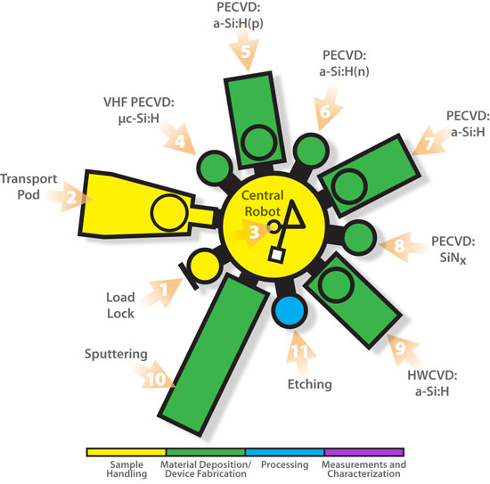
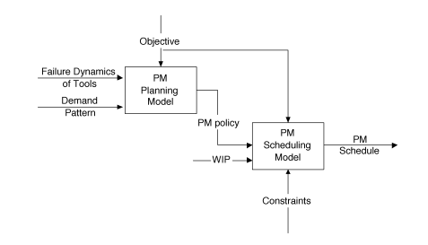

# paper study

## About Maintenance & Scheduling

## Multi-objective production scheduling of probe process in semiconductor manufacturing

Production Planning & Control The Management of Operations Volume 11, 2000 - Issue 7

_Young Hoon Lee, Byung Ki Lee & Bongju Jeong_

{% embed data="{\"url\":\"https://www.tandfonline.com/doi/abs/10.1080/095372800432124\",\"type\":\"link\",\"title\":\"Multi-objective production scheduling of probe process in semiconductor manufacturing\",\"description\":\"Semiconductor products are manufactured through the process of wafer fabrication, probe or electrical die sorting, assembly and final test. In particular, in this study we deal with the wafer probe process which requires several types of equipment with different capacities. As a connecting procedure of the fabrication and the assembly, the probe process may determine the capacity of whole semiconductor manufacturing. The throughput needs to be maximized as for most manufacturing lines. Because of unexpected machine failure and planned preventive maintenance, the utilization of machines has to be kept at a certain range for stabilizing the process. Hence, the production progress for each device and the utilization of machines are objectives to be maximized simultaneously, while both tend to work in opposite directions because of changeover time loss.\",\"icon\":{\"type\":\"icon\",\"url\":\"https://www.tandfonline.com/favicon.ico\",\"aspectRatio\":0},\"thumbnail\":{\"type\":\"thumbnail\",\"url\":\"https://www.tandfonline.com/doi/cover-img/10.1080/095372800432124\",\"width\":110,\"height\":146,\"aspectRatio\":1.3272727272727274}}" %}

In probe process, 

Different devices can be processed in the same machines. Each combinations have different capacity \(production rate\).

The utilization are ~95% is the most practical in mfg line, because 6-10%of machine time is contributed to machine failure or preventive maintenance time.

To meet the monthly production target, also objective to minimize the number of machines. \(In order to reduce the probability of machine failure\)

### Problem1: Monthly production planning

Objective function: $$Min \Sigma  \Sigma x_{i,j} $$ 

 $$x_{i,j}$$: the number of machines of type  $$i$$ to process device $$j$$ 

Constraints: 1.Machine capability 2.Production Target 3. Equipment Availability

### Problem2 : Daily production planning and scheduling

using Heuristic Scheduling Algorithm\*4

1.PR \(maximize production volume and progress\)

2.UT \(maximize utilization of machines\)

3.HB \(Hybrid heuristic for maximize both\)

4.LP \(LP-based heuristic for maximize both\)

Multi-objective: 1.Production Volume Rate 2.Utilization --&gt; Weighted

### Results

LP-based heuristic has the best performance. 

## Optimal Preventive Maintenance Scheduling in Semiconductor Manufacturing

 Xiaodong Yao, Member, IEEE, Emmanuel Fernández-Gaucherand, Senior Member, IEEE, Michael C. Fu, and Steven I. Marcus, Fellow, IEEE



Semiconductor PM scheduling challenge:

1. **Highly integrated system**: A PM schedule on one tool can have significant impact on upstream or downstream tools.
2. **Cluster Tools**: A cluster tool is a highly integrated machine that is composed of several chambers and robots, where different PM tasks on different chambers have to be coordinated carefully in order to maximize the availability \(therefore, throughput\) of the entire tool.

### Consideration:

**Interdependence of PM tasks** : The entire tool's availability is dependent on each chamber.

**Uncertainty of WIP**  : PM tasks should be avoided when a large amount of work is expected to arrive soon.

time window policy --&gt; “pull” or “push” a planned PM task beyond a certain period 

Besides...

better to **Consolidate** PM tasks

**Tool failures, costs for supplies, lost production, technician availability constraints**, should also be accounted for

### Hierarchical PM Planning and Scheduling

#### 1. Long-term horizon: PM planning model

Considering **technical state** \(conventional\) information  ,e.g.age of machines

and **operating state** information , e.g.demand pattern

formulated as MDP \(**Markov Decision Process**\) due to feature of underlying stochastic processes and sequential decision epoches.

--&gt; Output : **Optimized time window policy**

#### 2. Short-term horizon: PM scheduling model

1. Interdependence of different PM tasks in terms of their joint impact on the entire tool’s throughput.
2. **Match up** between the tool’s availability and projected incoming WIP.

### Background

two types of PM : Calendar-based, Operation-based

Even if a PM window is operation-based, e.g., “2000 wafers 10%” since last PM, it will be converted to a calendar basis. If an optimization model were to track wafer count, this would lead to a very high level of computational complexity. _\[HOW TO convert, see reference 15\]_

### MIP of PM scheduling

MIP\(Mixed Integer Programming\) model

Target : To determine the best time for doing each PM

Input : configuration matrix for a cluster tool

A set of PM tasks need to be placed within the time window.

Objective : Max overall tool availability, Min WIP

...

## 

{% embed data="{\"url\":\"https://www.hindawi.com/journals/mpe/2012/875641/\",\"type\":\"link\",\"title\":\"Genetic Algorithm for Job Scheduling with Maintenance Consideration in Semiconductor Manufacturing Process\",\"description\":\"This paper presents wafer sequencing problems considering perceived chamber conditions and maintenance activities in a single cluster tool through the simulation-based optimization method. We develop optimization methods which would lead to the best wafer release policy in the chamber tool to maximize the overall yield of the wafers in semiconductor manufacturing system. Since chamber degradation will jeopardize wafer yields, chamber maintenance is taken into account for the wafer sequence decision-making process. Furthermore, genetic algorithm is modified for solving the scheduling problems in this paper. As results, it has been shown that job scheduling has to be managed based on the chamber degradation condition and maintenance activities to maximize overall wafer yield.\",\"icon\":{\"type\":\"icon\",\"url\":\"https://www.hindawi.com/images/apple-touch-icon-144x144.png\",\"width\":144,\"height\":144,\"aspectRatio\":1},\"thumbnail\":{\"type\":\"thumbnail\",\"url\":\"https://images.hindawi.com/images/social/MPE.jpg\",\"width\":1200,\"height\":630,\"aspectRatio\":0.525}}" %}



